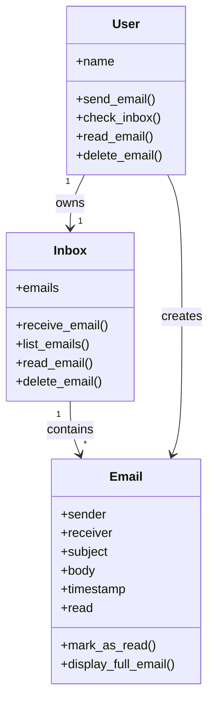
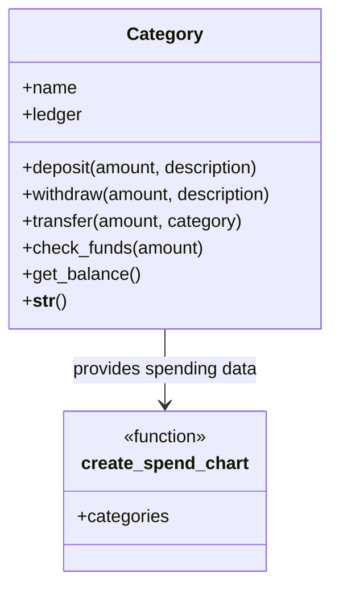

# freecodecamp-python-certification

# RGB Character – freeCodeCamp Python Certification

This repository contains my solution for the **“RGB Character”** challenge from the  
**freeCodeCamp Python Certification Course**.

---

## Problem Overview

The goal of this challenge is to create a function that:
- Validates a character name
- Validates character stats (Strength, Intelligence, Charisma)
- Ensures strict type checking
- Enforces total stat points
- Displays stats using dot-based visualization

---

## Function Rules

### Name Validation
- Must be a string
- Cannot be empty
- Maximum length: 10 characters
- Must not contain spaces

### Stat Rules
- Strength, Intelligence, Charisma must be integers
- Values must be between **1 and 4**
- Total stat points must equal **7**
- Boolean values are rejected

---

## Example Usage

```python
print(create_character("Arin", 3, 2, 2))

Output
Arin
STR ●●●○○○○○○○
INT ●●○○○○○○○○
CHA ●●○○○○○○○○
```
---

## Build a Pin Extractor – freeCodeCamp Challenge

### Description
This challenge extracts a secret numeric PIN from poems.  
Each digit of the PIN is formed by counting the number of letters
in a specific word position for each line of the poem.

### Logic Overview
- Each poem is split into lines
- For each line:
  - The word at index `line_number` is selected
  - The length of that word becomes a digit in the PIN
  - If no such word exists, `0` is used
- One PIN is generated per poem
---
### Example

```python
print(pin_extractor([poem, poem2, poem3]))

Output
['51420', '44440', '11111']
```
---

## Build a Number Pattern Generator – freeCodeCamp Lab

### Description
This lab focuses on practicing basic Python concepts by generating
a number pattern using a `for` loop.

### Requirements
- The function accepts a single integer argument `n`
- Returns numbers from `1` to `n` separated by spaces
- Uses a `for` loop
- Handles invalid input with appropriate error messages
---
### Example

```python
print(number_pattern(5))

Output
1 2 3 4 5
```
---
### Error Handling

```python
number_pattern("5")

Output
Argument must be an integer value.
```
---
## Build a Medical Data Validator – freeCodeCamp Workshop

### Description
This workshop task validates structured medical records using
type checking, regular expressions, and rule-based constraints.

The validator ensures that each medical record follows a strict schema
and reports detailed validation errors when rules are violated.

---

### Validation Rules

- `patient_id`: string starting with `P` or `p` followed by digits
- `age`: integer ≥ 18
- `gender`: `male` or `female` (case-insensitive)
- `diagnosis`: string or `None`
- `medications`: list of strings
- `last_visit_id`: string starting with `V` or `v` followed by digits

---

### Example

```python
validate(medical_records)

Output - 
Unexpected format 'patient_id: p1002' at position 1.
Unexpected format 'last_visit_id: v2302' at position 1.
Unexpected format 'last_visit_id: v2303' at position 2.
Valid format.
```
---

## Build a User Configuration Manager – freeCodeCamp Lab

### Description
This lab implements a simple user configuration manager that allows
adding, updating, deleting, and viewing user settings.

All settings are normalized to lowercase internally, while displayed
settings follow proper formatting rules.

---

### Supported Operations

- **Add Setting**
  - Adds a new key-value pair if the key does not already exist
- **Update Setting**
  - Updates the value of an existing setting
- **Delete Setting**
  - Removes a setting if it exists
- **View Settings**
  - Displays all settings in a formatted, readable format

---

### Example

```python
view_settings({
    'theme': 'dark',
    'notifications': 'enabled',
    'volume': 'high'
})
```
---
### Output
```python
Current User Settings:
Theme: dark
Notifications: enabled
Volume: high
```
---
# Debug an ISBN Validator

## Description
The ISBN (International Standard Book Number) is a unique identifier assigned to commercial books.  
An ISBN can be either **10 or 13 digits long**, where the last digit is a **check digit** calculated from the other digits.

This project focuses on debugging and fixing an existing ISBN validator so that it correctly validates **ISBN-10** and **ISBN-13** codes while handling invalid inputs gracefully.  
This lab is part of the **freeCodeCamp Python Certification**.

---

## Objective
The goal of this project is to:
- Validate ISBN-10 and ISBN-13 codes correctly
- Handle all runtime errors without crashing
- Display meaningful error messages for invalid inputs
- Pass all freeCodeCamp test cases successfully

---

## Input Format
The user must enter input in the following format:
`ISBN,length`

### Examples
`1530051126,10`
`9781530051120,13`

### Notes
- ISBN should not contain hyphens
- Length must be either `10` or `13`
---

## Program Behavior
Based on the input, the program displays one of the following messages:

 `Valid ISBN Code.`
 `Invalid ISBN Code.`
 `ISBN-10 code should be 10 digits long.`
 `ISBN-13 code should be 13 digits long.`
 `Invalid character was found.`
 `Length should be 10 or 13.`
 `Length must be a number.`
 `Enter comma-separated values.`

---

## Valid Test ISBNs

### ISBN-10
`1530051126`
`9971502100`
`080442957X`

### ISBN-13
`9781530051120`
`9781947172104`

---

## Important Note
To ensure the freeCodeCamp tests run correctly, the `main()` function call must be commented out:

```python
# main()
```
---
## Build a Musical Instrument Inventory – freeCodeCamp Workshop

### Description
This workshop introduces **Object-Oriented Programming (OOP)** concepts in Python by building a simple musical instrument inventory system.

The program defines a `MusicalInstrument` class that stores details about an instrument and provides methods to interact with it.

---

### Objective
The goal of this workshop is to:
- Practice creating Python classes
- Use the `__init__` constructor
- Define instance methods
- Create and use multiple objects

---

### Features
- Store instrument name and instrument family
- Display a message when an instrument is played
- Return an informational fact about the instrument

---

### Example Usage

```python
instrument_1 = MusicalInstrument('Oboe', 'woodwind')
instrument_2 = MusicalInstrument('Trumpet', 'brass')

instrument_1.play()
print(instrument_1.get_fact())

instrument_2.play()
print(instrument_2.get_fact())
```
---
### Output
```python
The Oboe is fun to play!
The Oboe is part of the woodwind family of instruments.
The Trumpet is fun to play!
The Trumpet is part of the brass family of instruments.
```
---
## Build a Planet Class – freeCodeCamp Lab

### Description
This lab focuses on practicing **Object-Oriented Programming (OOP)** concepts in Python by building a `Planet` class.

The program validates constructor arguments, raises appropriate exceptions, and demonstrates how to use special methods like `__str__` along with instance methods.

---

### Objective
The goal of this lab is to:
- Create a Python class with proper initialization
- Validate input using exceptions
- Use instance attributes and methods
- Implement the `__str__` method
- Create and interact with multiple objects

---

### Class Requirements

#### `Planet` Class
- Accepts `name`, `planet_type`, and `star` as parameters
- Raises:
  - `TypeError` if any argument is not a string
  - `ValueError` if any argument is an empty string
- Stores values as instance attributes

#### Methods
- `orbit()`  
  Returns:  
  `{name} is orbiting around {star}...`

- `__str__()`  
  Returns:  
  `Planet: {name} | Type: {planet_type} | Star: {star}`

---

### Example Usage

```python
planet_1 = Planet("Earth", "Terrestrial", "Sun")
planet_2 = Planet("Jupiter", "Gas giant", "Sun")
planet_3 = Planet("Proxima Centauri b", "Exoplanet", "Proxima Centauri")

print(planet_1)
print(planet_2)
print(planet_3)

print(planet_1.orbit())
print(planet_2.orbit())
print(planet_3.orbit())
```
---

### Output
```python
Planet: Earth | Type: Terrestrial | Star: Sun
Planet: Jupiter | Type: Gas giant | Star: Sun
Planet: Proxima Centauri b | Type: Exoplanet | Star: Proxima Centauri
Earth is orbiting around Sun...
Jupiter is orbiting around Sun...
Proxima Centauri b is orbiting around Proxima Centauri...
```
---
## Build an Email Simulator – freeCodeCamp Workshop

### Description
This workshop simulates a basic **email system** using Python and object-oriented programming concepts.

The program models users, inboxes, and emails, allowing users to send, read, list, and delete emails while tracking read status and timestamps.

---

### Objective
The goal of this workshop is to:
- Practice advanced OOP concepts
- Work with multiple interacting classes
- Use timestamps with the `datetime` module
- Track email read/unread state
- Simulate real-world application behavior

---

### System Components

#### `Email` Class
- Stores sender, receiver, subject, body, timestamp, and read status
- Marks emails as read when opened
- Displays full email details
- Implements `__str__` for summary display

#### `Inbox` Class
- Stores received emails
- Lists all emails
- Reads individual emails
- Deletes emails safely with index validation

#### `User` Class
- Owns an inbox
- Sends emails to other users
- Reads and deletes emails from inbox

---

### Example Usage

```python
tory = User('Tory')
ramy = User('Ramy')

tory.send_email(ramy, 'Hello', 'Hi Ramy, just saying hello!')
ramy.send_email(tory, 'Re: Hello', 'Hi Tory, hope you are fine.')

ramy.check_inbox()
ramy.read_email(1)
ramy.delete_email(1)
ramy.check_inbox()
```
---
### Output
```text
Email sent from Tory to Ramy!

Email sent from Ramy to Tory!

Ramy's Inbox:

Your Emails:
1. [Unread] From: Tory | Subject: Hello | Time: 2026-01-21 16:54

--- Email ---
From: Tory
To: Ramy
Subject: Hello
Received: 2026-01-21 16:54
Body: Hi Ramy, just saying hello!
------------

Email deleted.

Ramy's Inbox:
Your inbox is empty.
```
---
### Class Interaction Diagram


---
# Budget App (freeCodeCamp Certification Project)

## Description
The Budget App is a simple Python application that helps track spending across different budget categories. It allows users to deposit money, withdraw funds, transfer amounts between categories, and visualize spending distribution using a text-based bar chart.

This project is part of the **freeCodeCamp Python Certification** and focuses on object-oriented programming, data handling, and string formatting.

---

## Objective
To build a budget management system that:
- Tracks financial transactions per category
- Prevents overspending using balance checks
- Displays a formatted ledger for each category
- Generates a percentage-based spending chart

---

## User Stories (Short)
- Create a `Category` class to manage budget categories
- Store all transactions in a ledger
- Allow deposits, withdrawals, and transfers
- Prevent withdrawals when funds are insufficient
- Print category details in a formatted output
- Generate a spending percentage chart across categories

---

## System Components

### 1. Category Class
Responsible for managing individual budget categories.

**Attributes:**
- `name` – category name
- `ledger` – list of all transactions

**Methods:**
- `deposit(amount, description)`
- `withdraw(amount, description)`
- `transfer(amount, category)`
- `check_funds(amount)`
- `get_balance()`
- `__str__()` – formatted category output

---

### 2. create_spend_chart(categories)
A standalone function that:
- Calculates total spending per category
- Computes percentage spent (rounded down to nearest 10)
- Builds a vertical bar chart using text

---

## Example Usage

```python
food = Category("Food")
clothing = Category("Clothing")
auto = Category("Auto")

food.deposit(1000, "deposit")
food.withdraw(105.55)
food.withdraw(15.89)

clothing.deposit(500)
clothing.withdraw(33.40)

auto.deposit(1000)
auto.withdraw(50)

print(food)
print(create_spend_chart([food, clothing, auto]))
```
---
### Output
```text
*************Food*************
deposit                1000.00
                        -105.55
                        -15.89
Total: 878.56

Percentage spent by category
100|          
 90|          
 80|          
 70|          
 60| o        
 50| o        
 40| o        
 30| o        
 20| o  o     
 10| o  o  o  
  0| o  o  o  
    ----------
     F  C  A  
     o  l  u  
     o  o  t  
     d  t  o  
        h     
        i     
        n     
        g     
```
---
---
### UML Diagram (Mermaid)




